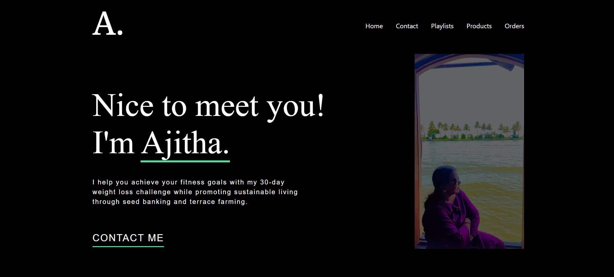
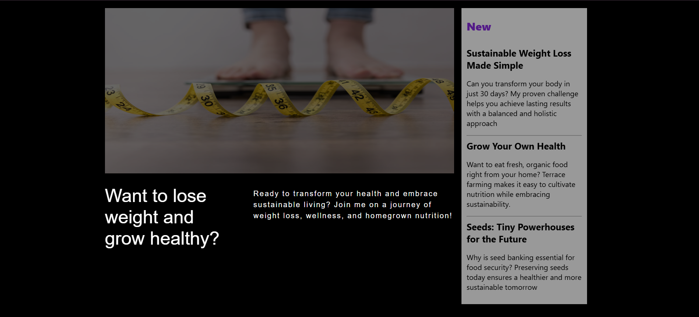
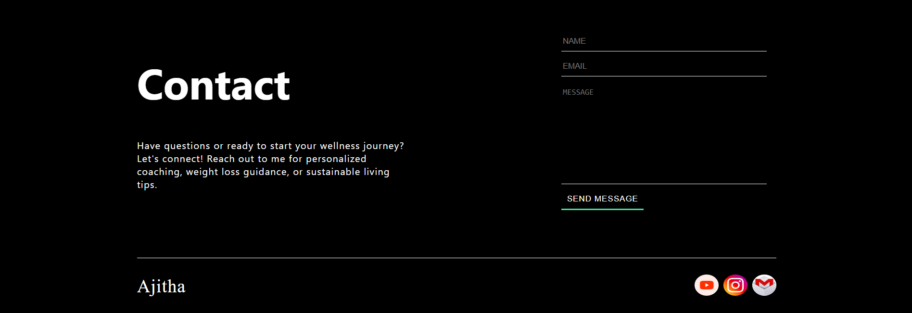
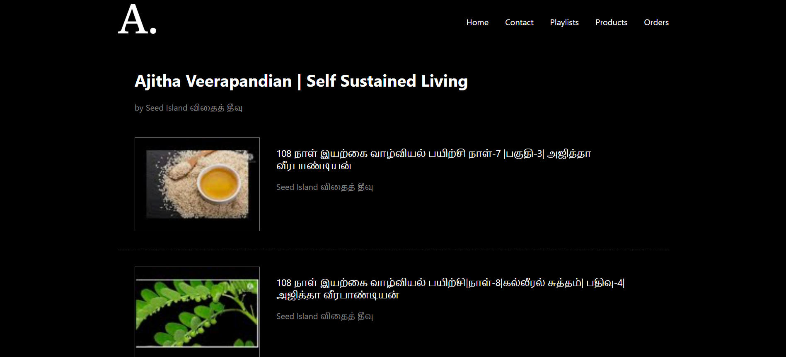

# Ajitha's Corner 

Ajitha's Corner is a dedicated platform showcasing Ajitha’s journey and contributions toward sustainable healthy living. This website serves as:

- A hub for her work, featuring insightful videos on wellness and sustainability.
- An e-commerce platform to explore and purchase her homemade soup bases and other healthy products.
- A personalized AI-powered diet planner, leveraging GPT to generate customized meal recommendations.

## Technologies used:

- Frontend: React.js, Redux, CSS
- APIs: YouTube API, Groq API
- Backend & Deployment: Firebase, Netlify

This project integrates AI and e-commerce capabilities, making it a seamless experience for users looking to adopt a healthier lifestyle.

### HomePage view

### PlayList and Video Views

